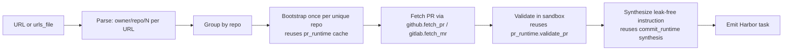

# `pr_to_env`

**Here's a URL, here's a task.** Hand `pr_to_env` a single GitHub / GitLab PR
URL (or a curated file of them) and it produces **one Harbor RL environment per
PR**, verified end-to-end. Same task shape and same verifier as
[`pr_runtime`](./pr_runtime.md) — the difference is the *input surface*: a
specific PR you already chose, not a mining sweep over a repo's history. It is
the first **"import-shape"** pipeline in the set (see
[RFC 0007](../rfcs/0007-pr-to-env.md)).

> **Status: experimental.** Shipped with `experimental = True`. Not a mining
> pipeline, so there is no reference-dataset requirement to promote — the
> promotion criterion is just "quality holds up on a diverse enough set of URLs."

## Walkthrough — the two commands

```bash
# single URL → one env
repo2rlenv generate --pipeline pr_to_env \
  --pipeline-opt url=https://github.com/pallets/click/pull/3434 \
  --llm anthropic/claude-sonnet-4-6 \
  --out ./datasets/click-3434

# curated file — one URL per line, `#` comments ok → one env per URL
repo2rlenv generate --pipeline pr_to_env \
  --pipeline-opt urls_file=./curated.txt \
  --llm anthropic/claude-sonnet-4-6 \
  --out ./datasets/curated
```

`--repo` is **optional** — the target repos are derived from the URLs
themselves. When a curated list spans multiple repos, bootstrap runs **once per
unique repo** (grouped by `(owner, name, ref)`), so a list that reuses repos
already in cache costs zero extra bootstraps. Exactly one of `url` / `urls_file`
must be set.

## Import vs. mining — why this is a separate pipeline

Everything else we ship is a **mining pipeline**: point `--repo` at a repo, walk
its PRs / commits / CVEs, filter, keep whatever passes the yield gate. Mining is
the right shape when you want to build a reference dataset from a repo you care
about. `pr_to_env` **inverts the assumption**:

| | **Mining** (`pr_runtime`, `commit_runtime`, …) | **Import** (`pr_to_env`) |
|---|---|---|
| Input | one repo, N candidates | N specific PR URLs, no filtering promise |
| Yield semantics | `emitted ÷ candidates_examined`, expected < 100% | per-URL success/skip — you get an env **or a specific reason** for each URL |
| `limit` / `since` / `lite_filter` | central | absent (you did the filtering) |
| Failure semantics | filtered → dropped silently | filtered → **surface the reason per URL** |
| CLI shape | `--repo` | `--pipeline-opt url=…` / `urls_file=…` |

Mining says "here's a corpus, tell me what qualifies." Import says "here's what
qualifies, tell me if you can build it." `pr_to_env` is `pr_runtime`'s
*consumption-side sibling* — same output, same verifier, different input
assumption. This is why it exists rather than being a `--pr-urls` flag on
`pr_runtime`: a URL-list input needs an entirely different (per-URL, not
aggregate) failure-reporting story and forbids the mining knobs as meaningless.

## What we produce per URL

Identical to `pr_runtime`:

```
<owner>__<repo>-<pr_number>/
├── task.toml                 # Harbor metadata + [metadata.repo2env] provenance
├── instruction.md            # PR title + body, info-leak stripped (never the URL)
├── environment/Dockerfile    # FROM <bootstrap_image>; the env is already built
├── tests/test.sh             # graded F2P/P2P eval script (verbatim from pr_runtime)
└── solution/patch.diff       # the gold patch (source files only)
```

The provenance block distinguishes curated tasks from mined ones and records the
originating URL for traceability:

```toml
[metadata.repo2env]
pipeline   = "pr_to_env"                                   # not "pr_runtime"
source_url = "https://github.com/pallets/click/pull/3434"  # the URL you handed in
```

> **Leak note.** `source_url` is a fix-pointer, so it lives **only** in
> `task.toml`'s `[metadata.repo2env]` block — never in `instruction.md`. The
> agent never sees the URL.

## Algorithm



1. **Parse** each URL into `(host, owner, name, pr_number)`; anything that isn't
   a PR URL is rejected with an error naming the URL.
2. **Group by repo** so bootstrap runs once per unique repo, not once per PR.
3. **For each repo**: ensure bootstrap (cache-hit path is instant), then for each
   PR fetch metadata + diff via `github.fetch_pr` / `gitlab.fetch_mr`.
4. **Validate** with `pr_runtime.validate_pr` verbatim — no new verifier logic.
5. **Synthesize** a leak-free instruction the same way `commit_runtime` does.
6. **Emit** a Harbor task with the shared `pr_runtime` shape.

## Options

These are the **final** options. (`pin_transitive_deps` does **not** exist.)

| Option | Default | Effect |
|---|:-:|---|
| `url` | `None` | single PR URL. Exactly one of `url` / `urls_file` must be set |
| `urls_file` | `None` | path to a file of URLs, one per line; `#` comments allowed |
| `strict` | `False` | `True` → any per-URL failure aborts the whole run (fail-fast). `False` → log + skip the failure, emit the rest, record per-URL outcomes in `PipelineResult.skip_reasons` |
| `require_new_test_funcs` | `True` | drop PRs that don't add a *new* test function (cleaner F2P) — inherited from `pr_runtime` |
| `min_problem_statement_words` | `0` | gates fallback instruction quality; default 0 because you curated the URLs |
| `synthesize_with_llm` | `True` | rewrite the PR body into a leak-free problem statement (inherits `commit_runtime`'s synthesis); `False` uses `pr_runtime`'s `_build_instruction` verbatim |
| `min_f2p` | `3` | FAIL_TO_PASS count floor; below it the env is flagged `calibration = "low_signal"` |
| `min_p2p` | `3` | PASS_TO_PASS count floor; below it the env is flagged `calibration = "low_signal"` |
| `oracle_gate` | `True` | after emit, run the gold patch through `harbor run -a oracle` and drop the env if `reward != 1.0` — the shipping criterion |

There are **no mining knobs** (`limit`, `since`, `lite_filter`) by design: hand
over 100 URLs, get 100 attempts. `strict` controls what happens when a URL can't
produce an env. (Additional plumbing knobs exist — `hard_drop_low_signal`,
`oracle_timeout_sec`, `validation_timeout_sec`, `skip_validation`,
`llm_temperature`, `max_llm_tokens` — but the table above covers the levers you
reach for.)

## Per-URL failure taxonomy

Because you chose the URLs, the pipeline never drops a URL silently — every
failed URL comes back with a distinct reason in `PipelineResult.skip_reasons`
(and, under `strict=True`, aborts the run naming that URL):

| Skip reason | Meaning |
|---|---|
| `pr_fetch_failed` | PR metadata fetch failed (network / auth / not found) |
| `non_bug_pr` | the PR isn't a bug fix (revert, cherry-pick, release chore, …) — filtered by title |
| `diff_fetch_failed` | the PR diff fetch failed |
| `empty_source_patch` | no source changes remain after splitting source vs. test hunks |
| `no_test_patch` | the PR adds no test files — no F2P signal, nothing to verify |
| `no_new_test_funcs` | `require_new_test_funcs=True` but the test_patch modifies existing tests only (no `+def test_` hunks) |
| `apply_failed` | the test patch doesn't apply cleanly at `base_commit` (a rebased/squashed PR can hit this) — from `classify_validation` |
| `no_fail_to_pass` | validation ran but no test flipped fail→pass with the fix applied |
| `bootstrap_failed` | bootstrap / checkout / `test_cmds` setup failed in the container |
| `f2p_below_floor` | FAIL_TO_PASS count is below `min_f2p` (only drops the env when `hard_drop_low_signal=True`) |
| `oracle_below_1` | `oracle_gate=True` and the gold patch scored `reward != 1.0`, so the emitted env was dropped |
| `validation_failed` | catch-all from `classify_validation` for any validation failure that doesn't match a more specific reason above |

> The RFC's abstract `network_error` maps to the concrete `pr_fetch_failed` /
> `diff_fetch_failed` keys the shipped pipeline emits.

## Yield

Yield is fundamentally different from mining pipelines: **you chose the URLs**, so
there's no candidate-vs-emitted denominator. The relevant number is **per-URL
success rate**, **~85–95% on well-chosen PRs** (has tests, tests are runnable,
repo bootstraps clean). A URL that fails comes back with one of the reasons
above rather than a dropped entry in an aggregate ratio.

## Cost

- **`at bootstrap` (cached)** — one-time per `(repo, ref)`. A curated list that
  reuses repos already in cache costs zero LLM.
- **`at synthesis` (per emitted task)** — one Sonnet call to rewrite the PR body
  into a leak-free problem statement (~$0.01–0.03 per task).

A 100-env curated dataset runs ~$1–3 of Sonnet calls if all bootstraps are
cached; budget $3–8 per uncached repo for fresh bootstraps.

## Reuse & anti-contamination

No new verifier logic and no new leak defenses — `pr_to_env` imports (never
copies) `pr_runtime`'s `validate_pr`, `build_eval_script`,
`build_environment_dockerfile`, and instruction-hygiene helpers, plus
`_env_guard.py`'s git-history scrub + egress guard. See
[`pr_runtime`](./pr_runtime.md) and the
[contamination defenses](./README.md#contamination-defenses) section for details.

## References

- [RFC 0007 — `pr_to_env`](../rfcs/0007-pr-to-env.md) — full design + rollout.
- [`pr_runtime`](./pr_runtime.md) — the pipeline whose output shape + verifier this reuses.
- [`commit_runtime`](./commit_runtime.md) — the LLM-synthesis instruction path this inherits.
